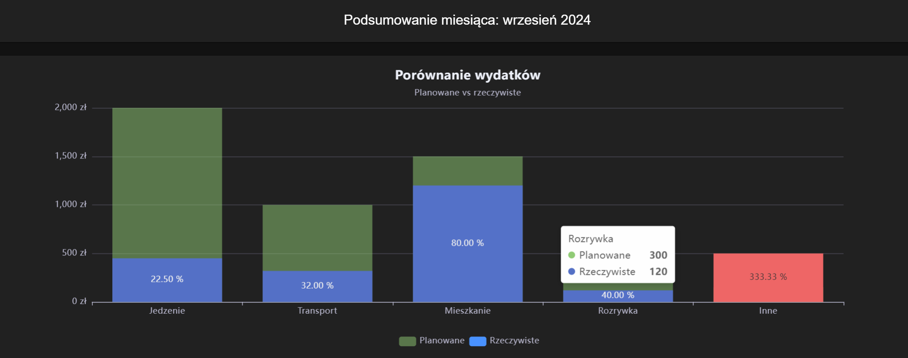
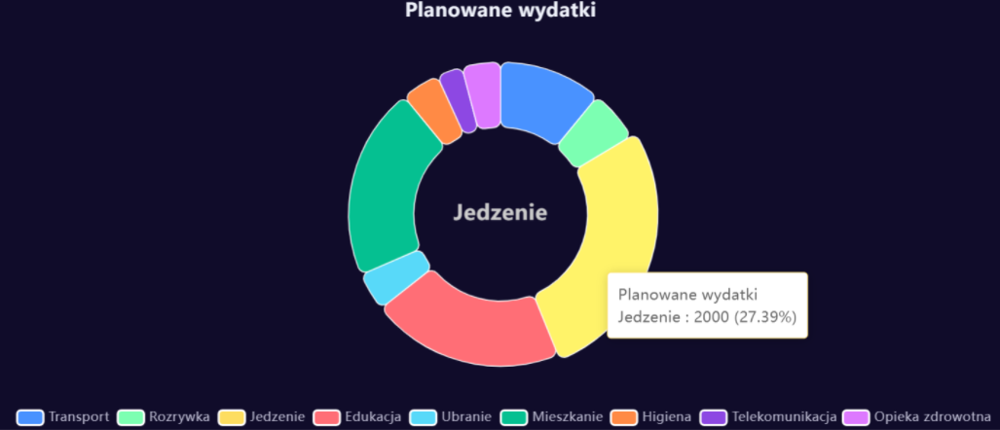

# Home Budget application

This project is a home budget management frontend application built using Nuxt.js and Vue.js. The application provides users with a robust interface to manage their finances by tracking expenses, visualizing budget data, and creating yearly and monthly budgets and much more.


## Application Previews

<br> </br>


To get started, make sure to install the dependencies for the project:

```bash
# npm
npm install

# pnpm
pnpm install

# yarn
yarn install

# bun
bun install

```

You can start the development server locally at http://localhost:3000:

```bash
# npm
npm run dev

# pnpm
pnpm run dev

# yarn
yarn dev

# bun
bun run dev
```


## Features

This home budget application includes the following features:

- **Annual and Monthly Budgeting**: Create budgets for both annual and monthly timeframes.
- **Custom Budget Categories**: Define your own categories for income and expenses.
- **Draft Budget Categories**: Mark budget categories as "draft" for use in templates for newly created budgets.
- **Transaction Management**: Add, edit, and delete transactions.
- **Server-Side Rendering for Transactions**: Transactions are rendered server-side for improved performance.
- **Data Visualization**: Track your spending with charts, visualize planned expenses for each category, and see recent transactions.
- **User Authentication**: Users can register and log in to their personalized budget dashboard.
- **JWT-Based Authentication**: Authentication between the frontend and server is based on JSON Web Tokens (JWT).
- **CSRF Protection**: Antiforgery tokens are used to protect the application against CSRF attacks.
- **Spending Limit Notifications**: Receive notifications if you exceed the budget in any category for a given month.
- **RPC-Based API Communication**: The entire application communicates with the backend API using Remote Procedure Call (RPC).
- **Responsive Design**: The UI is fully responsive for use on both desktop and mobile devices.

## Commands for Development

The following commands are available for development and production management:

```bash
# Start the development server
npm run dev

# Build the project for production
npm run build

# Preview the production build
npm run preview

```

## Future Enhancements

Some potential future enhancements for the application include:

- **Export/Import Data**: Allow users to export their budget data to CSV or import data from other systems.
- **Additional Emails Notifications**: Enhance notifications for more advanced user-defined thresholds or reminders, including the option for email notifications.
- **Testing Framework**: Consider implementing unit tests for key services using Jest to ensure code quality and reliability, implementing e.g.  [Jest](https://jestjs.io/)

